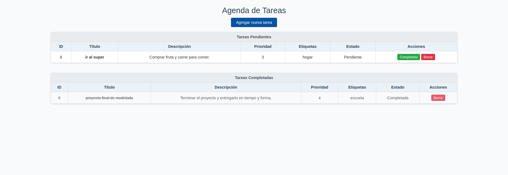
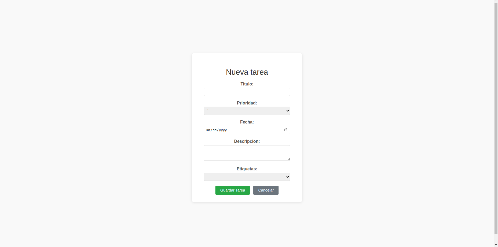

# 🗂️ Agenda Web – Gestión de Tareas con Django

Este proyecto implementa una **agenda de tareas** en una aplicación web accesible desde el navegador.  
El sistema permite crear, visualizar, completar y eliminar tareas, implementando el patrón de arquitectura **Modelo-Vista-Plantilla (MVT)** de Django y cumpliendo con los estándares **PEP 8**.

---

## Requisitos

- Python **3.10** (o superior)
- Django (se instala vía pip)
- Entorno virtual venv

---

## Instalación

1. Crear y activar entorno virtual:
   python3 -m venv venv
   source venv/bin/activate  

2. Instalar dependencias:
   pip install django

3. Preparar la base de datos (Migraciones):
   cd proyecto_final
   python manage.py makemigrations
   python manage.py migrate

## Uso

Una vez instalado, inicia el servidor:
python manage.py runserver

Luego abre tu navegador en:
http://127.0.0.1:8000/

## Acciones disponibles en la Web
+Creación de Tareas:  
    Formulario validado para registrar tareas con título, prioridad (1-5), fecha límite, descripción y etiquetas.

+Organización Visual:  
    Visualización automática en dos tablas separadas para tareas "Pendientes" y "Completadas".

+Gestión de Estado:  
    Botón verde "Completada" para marcar tareas como completadas con un solo clic.

+Limpieza (Eliminar):  
    Botón rojo "Borrar" para eliminar permanentemente tareas de la base de datos (SQLite).

## Estructura del proyecto

El repositorio separa el código web actual del historial de versiones anteriores:

MODELADO_PROYECTO_FINAL/   
├── proyecto_final/        (Contenedor Web Django)
│   ├── agenda/            (App Principal)
│   │   ├── models.py      
│   │   ├── views.py       
│   │   ├── forms.py       
│   │   ├── urls.py        
│   │   └── templates/     
│   ├── proyecto_final/    (Configuración Global)
│   ├── manage.py
│   └── db.sqlite3
├── codigo_anterior/       (Referencia CLI)
│   └── src/
├── venv/
└── README.md  

## Descripción técnica de archivos
El núcleo de la lógica se encuentra en la carpeta `agenda/`:

* **agenda/models.py**: Define la estructura de la BD. La clase `Tarea` incluye campos como título, prioridad, fecha, etiquetas y estado.
* **agenda/views.py**: Controlador del negocio.
    * `lista_tareas`: Renderiza la interfaz principal.
    * `nueva_tarea`: Procesa y guarda el formulario.
    * `completar_tarea` / `eliminar_tarea`: Acciones directas sobre la BD.
* **agenda/forms.py**: Configura `TareaForm`, personaliza los widgets (calendario) y limpia etiquetas.
* **agenda/urls.py**: Mapea las rutas web (`/nueva`, `/eliminar/<id>`) a sus vistas correspondientes.

## Ejemplos de ejecución

