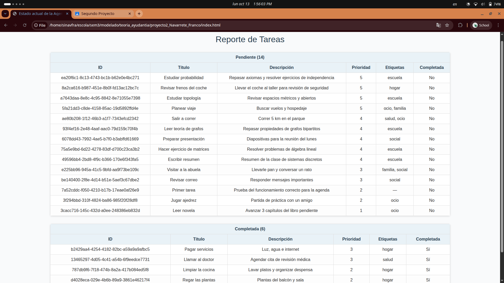
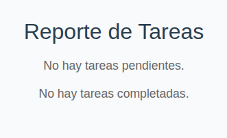

# 🗂️ Agenda – Gestion y Visualizacion de tareas en Agenda

Este proyecto implementa una **agenda de tareas** en Python, accesible desde la terminal mediante el comando `agenda`.  
Ademas, se puede generar un archivo html que visualiza en dos tablas (Pendientes/Completadas) las tareas ordenadas por 
prioridad, incluyendo un contador de cuantas tareas hay de cada tipo.
---

## Requisitos

- Python **3.12** (o la versión que estés usando en tu entorno)
- Entorno virtual venv

---

## Instalación

python -m venv venv
source venv/bin/activate

Instalar dependencias:
pip install -r requirements.txt

Configura el proyecto como comando del sistema:
pip install -e .
Esto registrará el comando agenda en tu entorno virtual.

## Uso
Una vez instalado, puedes ejecutar:
agenda --help

## Comandos disponibles para la agenda
+Agregar tarea:  
    agenda add --titulo "Comprar pan" --descripcion "Ir a la panadería"
    --prioridad 2 --fecha 2025-09-22 --etiquetas hogar

+Listar tareas:  
agenda ls --por prioridad

+Marcar tarea como completada:  
    agenda done <ID_TAREA>

+Eliminar tarea:  
    agenda rm <ID_TAREA>

+Buscar tarea por texto:  
    agenda find "panadería"

+Guardar agenda en archivo:  
    agenda save demo.json

+Cargar agenda desde archivo:  
    agenda load demo.json

## Comandos disponibles para general html
+Comando para generar archivo index.html
    python3 src/export_html.py <OPCIONAL:ruta_archivo_json (por default demo.json)> 
+Para abrir el archivo index.html, abrir una pestania de Chrome, presionar Ctrl+o, buscar en la carpeta raiz del
proyecto el archivo index.html y pulsar dos veces sobre el.

## Ejemplos de ejecucion

## Estructura del proyecto
Código:   
proyecto2_Navarrete_Franco/   
├── src/   
│   ├── agenda.py   
│   ├── tarea.py   
│   ├── io_json.py
│   ├── export_html.py
│   └── cli.py  
├── tests/  
│   ├── test_agenda.py  
│   └── test_cli.py  
├── requirements.txt  
├── pyproject.toml
├── index.html
├── styles.css
├── demo.json
├── reporte.txt
└── README.md  

## Pruebas unitarias
Ejecuta los tests con:  
pytest
# modelado_proyecto_final
